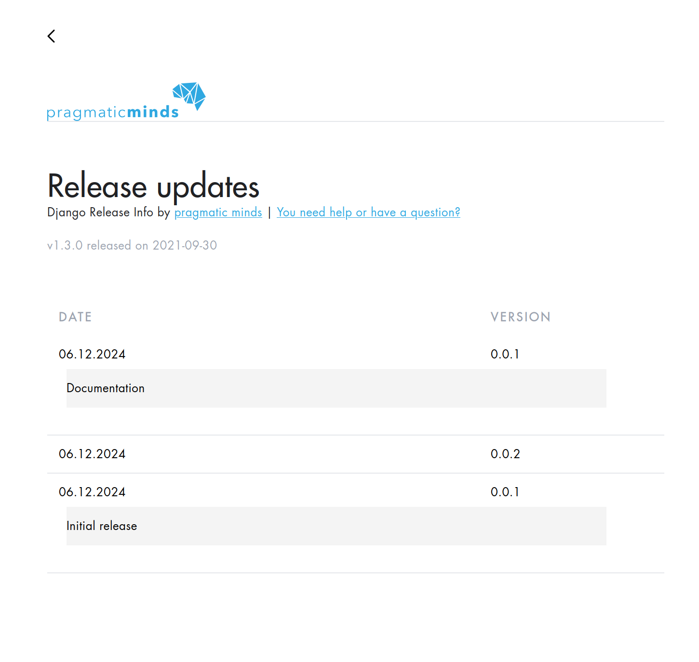

# Django Release Info

You can find the app source code in ./release_info



## Development

This repo has a test project so you can clone it and run the app.

```bash
python -m venv venv
source venv/bin/activate
pip install -r requirements.txt
python manage.py migrate
python manage.py runserver
```

### How to build

```bash
cd release_info
python -m build
```

###  How release

Pypi: `twine upload dist/*`
